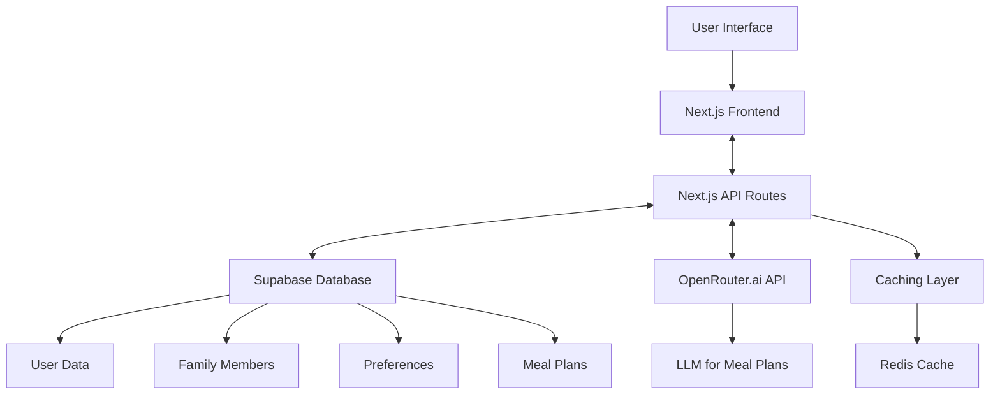
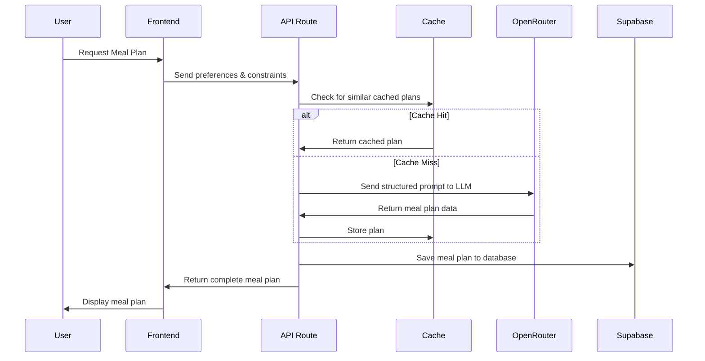
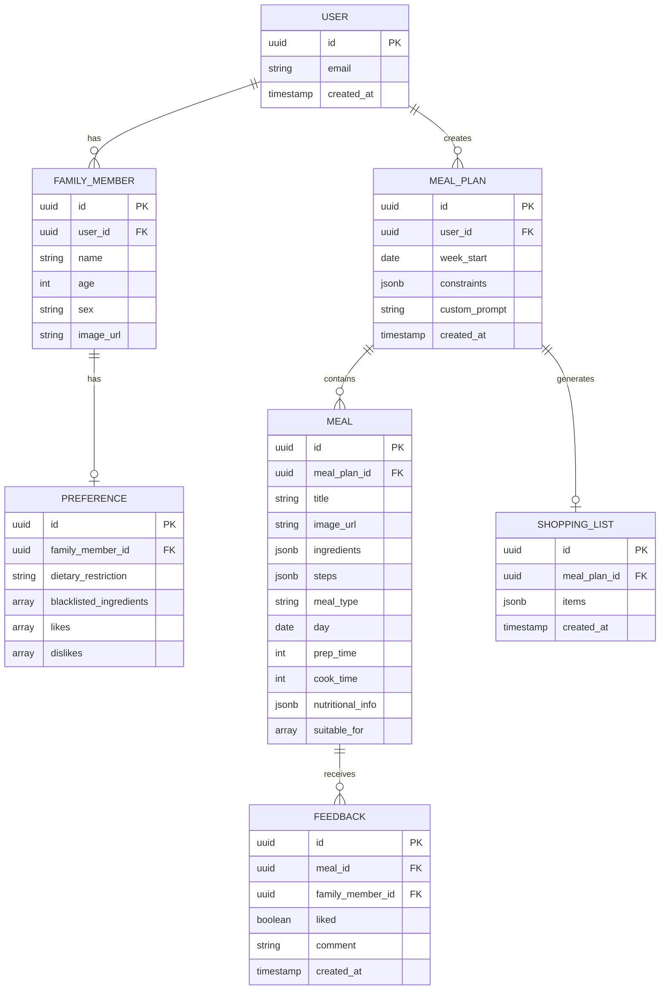
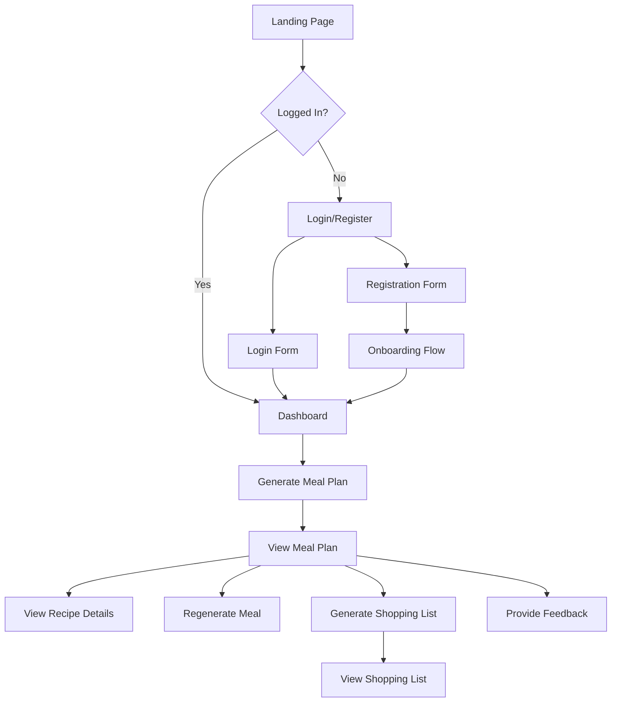

# RatatouAIlle: Family Meal Planner Web App
## Product Requirements Document (PRD)

## 1. Product Overview

### 1.1 Introduction

RatatouAIlle is a family-friendly, easy-to-use web application designed to generate personalized weekly meal plans for households with diverse dietary preferences and requirements. The application leverages OpenRouter.ai's API to access powerful language models for meal plan generation, providing users with comprehensive meal plans, recipes, and shopping lists.

### 1.2 Vision Statement

To simplify family meal planning by creating personalized, diverse, and nutritious meal plans that accommodate everyone's preferences and dietary needs, saving families time and reducing the stress of "what's for dinner?"

### 1.3 Target Audience

- Families with 2-20 members
- Primary users: Parents or meal planners in households
- Secondary users: Family members providing feedback on meals
- Users with diverse dietary needs and preferences
- Busy individuals seeking efficient meal planning solutions

### 1.4 Key Features

1. **Family Member Management**
   - Register family members (name, age, sex)
   - Support for up to 20 family members
   - Add/edit/remove members anytime

2. **Personalized Meal Preferences**
   - Pre-defined dietary options (vegan, gluten-free, etc.)
   - Ingredient blacklisting
   - Individual likes/dislikes per family member

3. **Meal Planning Constraints**
   - Meal-specific cooking time limits:
     - Breakfast: maximum 20 minutes
     - Lunch: maximum 30 minutes
     - Dinner: maximum 60 minutes
   - Global toggles (healthy, budget-friendly, kid-friendly)
   - Free-text input for additional prompt elements

4. **Meal Plan Generation**
   - Generate weekly meal plans (breakfast, lunch, dinner)
   - Display recipes with titles, ingredients, and steps
   - Option to regenerate specific meals

5. **Shopping List Generation**
   - Automatically generate shopping list from meal plan
   - Simple UI for viewing the list

## 2. User Personas

### 2.1 Primary Persona: Sarah, Busy Parent (35)

- **Background**: Working mother of two children (ages 8 and 5)
- **Goals**: Save time on meal planning, accommodate different family preferences
- **Pain Points**: Limited cooking time on weekdays, one child is picky eater, spouse has dietary restrictions
- **Needs**: Quick, family-friendly meals that everyone can enjoy

### 2.2 Secondary Persona: Michael, Health-Conscious Parent (42)

- **Background**: Father of three teenagers with different dietary preferences
- **Goals**: Ensure nutritious meals, teach healthy eating habits
- **Pain Points**: Balancing nutrition with teen food preferences, managing grocery budget
- **Needs**: Nutritious meal options that appeal to teenagers

### 2.3 Tertiary Persona: Emma, Multi-generational Household Manager (38)

- **Background**: Manages meal planning for extended family (parents, in-laws, children)
- **Goals**: Accommodate diverse dietary needs across generations
- **Pain Points**: Managing multiple dietary restrictions and preferences
- **Needs**: Flexible meal plans that can be adapted for different family members

## 3. User Stories and Requirements

### 3.1 Family Member Management

**User Stories:**
- As a user, I want to register my family members so that the app can generate personalized meal plans.
- As a user, I want to edit my family members' details so that I can keep information up to date.
- As a user, I want to remove family members so that I can maintain an accurate household profile.

**Requirements:**
- User can add up to 20 family members
- Required information: name, age, sex
- Optional information: profile picture
- Simple UI for adding/editing/removing members

### 3.2 Meal Preferences

**User Stories:**
- As a user, I want to set dietary restrictions for each family member so that the meal plan accommodates their needs.
- As a user, I want to blacklist specific ingredients for family members so that the meal plan avoids allergens or disliked foods.
- As a user, I want to specify likes and dislikes for each family member so that the meal plan includes preferred foods.

**Requirements:**
- Pre-defined dietary options: regular, vegetarian, vegan, pescatarian, keto, paleo, gluten-free, dairy-free
- Ability to blacklist specific ingredients per family member
- Ability to add likes and dislikes per family member
- Simple UI for managing preferences

### 3.3 Meal Planning Constraints

**User Stories:**
- As a user, I want to set maximum cooking times for each meal type so that meals fit my schedule.
- As a user, I want to specify global preferences for the meal plan so that it aligns with my family's needs.
- As a user, I want to add custom instructions to the meal planning process so that I can influence the results.

**Requirements:**
- Meal-specific cooking time limits:
  - Breakfast: default maximum 20 minutes (adjustable)
  - Lunch: default maximum 30 minutes (adjustable)
  - Dinner: default maximum 60 minutes (adjustable)
- Global toggles for:
  - Healthy meals
  - Budget-friendly meals
  - Kid-friendly options
- Free-text input field for additional prompt elements
- Simple UI for setting constraints

### 3.4 Meal Plan Generation

**User Stories:**
- As a user, I want to generate a weekly meal plan so that I can plan my grocery shopping and cooking.
- As a user, I want to see recipes for each meal so that I know how to prepare them.
- As a user, I want to regenerate specific meals so that I can customize the meal plan.

**Requirements:**
- Generate complete weekly meal plans (breakfast, lunch, dinner)
- Display recipes with:
  - Title
  - Ingredients
  - Step-by-step instructions
  - Cooking and prep time
  - Nutritional information
- Option to regenerate specific meals or entire days
- Simple UI for viewing and interacting with the meal plan

### 3.5 Shopping List Generation

**User Stories:**
- As a user, I want to generate a shopping list based on the meal plan so that I can efficiently shop for ingredients.
- As a user, I want to check off items on the shopping list so that I can track what I've purchased.

**Requirements:**
- Automatically generate shopping list from meal plan ingredients
- Consolidate duplicate ingredients
- Group ingredients by category (produce, dairy, meat, etc.)
- Simple UI for viewing and interacting with the shopping list

### 3.6 Authentication and User Management

**User Stories:**
- As a user, I want to create an account so that I can save my family's information and meal plans.
- As a user, I want to log in to access my saved data across sessions.
- As a user, I want a simple and secure authentication process that doesn't create friction.

**Requirements:**
- Simple email/password registration and login
- Social login options (Google, Facebook) for faster onboarding
- Password reset functionality
- Remember me option for convenience
- Session management with secure token storage
- Clear logout option

## 4. Technical Architecture

### 4.1 Technology Stack

- **Frontend**: React with TypeScript, Next.js for server-side rendering, and Tailwind CSS for styling
- **Backend**: Next.js API routes (unified frontend/backend)
- **Database**: Supabase (PostgreSQL + authentication + storage)
- **LLM API**: OpenRouter.ai API for accessing powerful language models for meal plan generation
- **Deployment**: Vercel for the Next.js application with Supabase cloud for backend services

### 4.2 System Architecture



### 4.3 API Integration

#### 4.3.1 OpenRouter.ai API Integration

OpenRouter.ai provides a unified API that allows access to various large language models. This section details how RatatouAIlle will integrate with OpenRouter.ai to generate meal plans.



##### OpenRouter.ai Request and Response Flow

1. **Request Preparation**:
   ```typescript
   // Prepare the request to OpenRouter.ai
   const requestBody = {
     model: "anthropic/claude-3-opus-20240229", // Or another preferred model
     messages: [
       { role: "system", content: systemMessage },
       { role: "user", content: userMessage }
     ],
     temperature: 0.7,
     max_tokens: 4000,
     headers: {
       "HTTP-Referer": "https://ratatouaille.com", // Your domain
       "X-Title": "RatatouAIlle Meal Planner"      // Your app name
     }
   };
   ```

2. **API Call**:
   ```typescript
   // Make the API call to OpenRouter.ai
   const response = await fetch("https://openrouter.ai/api/v1/chat/completions", {
     method: "POST",
     headers: {
       "Content-Type": "application/json",
       "Authorization": `Bearer ${process.env.OPENROUTER_API_KEY}`
     },
     body: JSON.stringify(requestBody)
   });
   
   const data = await response.json();
   ```

3. **Response Processing**:
   ```typescript
   // Extract the LLM's response
   const llmResponse = data.choices[0].message.content;
   
   // Parse the JSON response into a structured meal plan
   const mealPlan = parseMealPlanResponse(llmResponse);
   ```

4. **Error Handling**:
   ```typescript
   try {
     // API call and processing
   } catch (error) {
     // Implement retry logic
     if (retries < maxRetries) {
       // Wait and retry with exponential backoff
       await new Promise(resolve => setTimeout(resolve, 1000 * Math.pow(2, retries)));
       return generateMealPlan(familyMembers, preferences, constraints, customPrompt, retries + 1);
     }
     
     // If all retries fail, return a fallback plan or error message
     throw new Error("Failed to generate meal plan after multiple attempts");
   }
   ```

##### Model Selection Strategy

OpenRouter.ai provides access to various models with different capabilities and pricing. The application will implement a model selection strategy:

1. **Default Model**: Anthropic's Claude or similar high-quality model for reliable meal plan generation
2. **Fallback Models**: Less expensive models for when the primary model is unavailable or during high traffic
3. **Model Rotation**: Ability to switch between models based on performance, availability, and cost

#### 4.3.2 Supabase Integration

- Authentication: Email/password and social login options
- Database: PostgreSQL for structured data storage
- Storage: File storage for user-uploaded images and cached meal plans
- Real-time: Real-time updates for collaborative features (future)

## 5. Data Model

### 5.1 Entity Relationship Diagram



### 5.2 Database Schema

#### 5.2.1 Users Table

```sql
CREATE TABLE users (
  id UUID PRIMARY KEY DEFAULT uuid_generate_v4(),
  email TEXT UNIQUE NOT NULL,
  created_at TIMESTAMP WITH TIME ZONE DEFAULT NOW(),
  last_login TIMESTAMP WITH TIME ZONE
);
```

#### 5.2.2 Family Members Table

```sql
CREATE TABLE family_members (
  id UUID PRIMARY KEY DEFAULT uuid_generate_v4(),
  user_id UUID REFERENCES users(id) ON DELETE CASCADE,
  name TEXT NOT NULL,
  age INTEGER NOT NULL,
  sex TEXT NOT NULL,
  image_url TEXT,
  created_at TIMESTAMP WITH TIME ZONE DEFAULT NOW(),
  updated_at TIMESTAMP WITH TIME ZONE DEFAULT NOW()
);
```

#### 5.2.3 Preferences Table

```sql
CREATE TABLE preferences (
  id UUID PRIMARY KEY DEFAULT uuid_generate_v4(),
  family_member_id UUID REFERENCES family_members(id) ON DELETE CASCADE,
  dietary_restriction TEXT,
  blacklisted_ingredients TEXT[] DEFAULT '{}',
  likes TEXT[] DEFAULT '{}',
  dislikes TEXT[] DEFAULT '{}',
  created_at TIMESTAMP WITH TIME ZONE DEFAULT NOW(),
  updated_at TIMESTAMP WITH TIME ZONE DEFAULT NOW()
);
```

#### 5.2.4 Meal Plans Table

```sql
CREATE TABLE meal_plans (
  id UUID PRIMARY KEY DEFAULT uuid_generate_v4(),
  user_id UUID REFERENCES users(id) ON DELETE CASCADE,
  week_start DATE NOT NULL,
  constraints JSONB NOT NULL,
  custom_prompt TEXT,
  created_at TIMESTAMP WITH TIME ZONE DEFAULT NOW()
);
```

#### 5.2.5 Meals Table

```sql
CREATE TABLE meals (
  id UUID PRIMARY KEY DEFAULT uuid_generate_v4(),
  meal_plan_id UUID REFERENCES meal_plans(id) ON DELETE CASCADE,
  title TEXT NOT NULL,
  image_url TEXT,
  ingredients JSONB NOT NULL,
  steps JSONB NOT NULL,
  meal_type TEXT NOT NULL,
  day TEXT NOT NULL,
  prep_time INTEGER NOT NULL,
  cook_time INTEGER NOT NULL,
  nutritional_info JSONB,
  suitable_for UUID[] DEFAULT '{}',
  created_at TIMESTAMP WITH TIME ZONE DEFAULT NOW()
);
```

#### 5.2.6 Shopping Lists Table

```sql
CREATE TABLE shopping_lists (
  id UUID PRIMARY KEY DEFAULT uuid_generate_v4(),
  meal_plan_id UUID REFERENCES meal_plans(id) ON DELETE CASCADE,
  items JSONB NOT NULL,
  created_at TIMESTAMP WITH TIME ZONE DEFAULT NOW(),
  updated_at TIMESTAMP WITH TIME ZONE DEFAULT NOW()
);
```

#### 5.2.7 Feedback Table

```sql
CREATE TABLE feedback (
  id UUID PRIMARY KEY DEFAULT uuid_generate_v4(),
  meal_id UUID REFERENCES meals(id) ON DELETE CASCADE,
  family_member_id UUID REFERENCES family_members(id) ON DELETE CASCADE,
  liked BOOLEAN NOT NULL,
  comment TEXT,
  created_at TIMESTAMP WITH TIME ZONE DEFAULT NOW()
);

## 6. User Interface Design

### 6.1 User Flow



### 6.2 Key Screens

#### 6.2.1 Authentication Screens

#### Login Screen
- Email/password input fields
- "Remember me" checkbox
- "Forgot password" link
- Social login buttons (Google, Facebook)
- Link to registration for new users

#### Registration Screen
- Email input with validation
- Password input with strength requirements
- Confirm password field
- Terms of service acceptance
- Submit button
- Link back to login

#### Password Reset Screen
- Email input for reset link
- Confirmation message
- New password and confirmation inputs (after clicking email link)

#### 6.2.2 Landing Page
- Hero section with app description
- Benefits of using RatatouAIlle
- Call-to-action buttons (Sign Up, Log In)
- Sample meal plan preview

#### 6.2.3 Dashboard
- Weekly meal plan overview
- Quick actions (Generate new plan, View shopping list)
- Family member management
- Settings access

#### 6.2.4 Family Member Management
- List of family members
- Add/Edit/Remove functionality
- Profile picture upload option

#### 6.2.5 Preference Setting
- Dietary restriction selection
- Ingredient blacklisting
- Likes/dislikes input

#### 6.2.6 Constraint Setting
- Meal-specific cooking time inputs:
  - Breakfast: maximum cooking time input (default 20 minutes)
  - Lunch: maximum cooking time input (default 30 minutes)
  - Dinner: maximum cooking time input (default 60 minutes)
- Global toggle options
- Free-text input for custom prompt elements

#### 6.2.7 Meal Plan View
- Weekly calendar view
- Meal cards for each day/meal type
- Regenerate buttons for individual meals
- Generate shopping list button

#### 6.2.8 Recipe Detail View
- Ingredients list
- Step-by-step instructions
- Nutritional information
- Cooking and prep time
- Suitable for (family members)

#### 6.2.9 Shopping List View
- Categorized ingredients
- Checkbox for each item
- Print/share functionality

## 7. OpenRouter.ai Integration

### 7.1 Prompt Engineering

#### 7.1.1 System Message Design

```typescript
const systemMessage = {
  role: "system",
  content: `You are a professional nutritionist and chef specialized in creating personalized meal plans.
  Your task is to create a weekly meal plan (breakfast, lunch, dinner) for a family based on their preferences and constraints.
  
  Follow these guidelines:
  1. Each meal should be appropriate for the meal type (breakfast, lunch, dinner)
  2. Consider all family members' dietary restrictions and preferences
  3. Respect cooking time constraints for each meal type:
     - Breakfast: maximum {breakfastTime} minutes
     - Lunch: maximum {lunchTime} minutes
     - Dinner: maximum {dinnerTime} minutes
  4. Ensure variety throughout the week
  5. Provide complete recipes with ingredients and steps
  6. Format your response as a valid JSON object following the specified structure
  7. Be creative but practical with recipes that are feasible to prepare at home
  8. Consider nutritional balance across the week
  
  Response format:
  {
    "weeklyPlan": [
      {
        "day": "Monday",
        "meals": [
          {
            "type": "breakfast",
            "title": "Meal name",
            "description": "Brief description",
            "prepTime": 15,
            "cookTime": 20,
            "ingredients": ["ingredient1", "ingredient2", ...],
            "steps": ["step1", "step2", ...],
            "suitableFor": ["familyMemberId1", "familyMemberId2", ...],
            "nutritionalInfo": { "calories": 350, "protein": "20g", "carbs": "30g", "fat": "15g" }
          },
          // lunch and dinner objects with the same structure
        ]
      },
      // Repeat for each day of the week
    ]
  }`
};
```

#### 7.1.2 User Message Construction

```typescript
function constructUserMessage(
  familyMembers: FamilyMember[],
  preferences: Preference[],
  constraints: MealConstraints,
  customPrompt: string
): string {
  return `
  Create a weekly meal plan for the following family members:
  
  ${familyMembers.map(member => `
    Member ID: ${member.id}
    Name: ${member.name}
    Age: ${member.age}
    Sex: ${member.sex}
    Dietary Restrictions: ${preferences.find(p => p.familyMemberId === member.id)?.dietaryRestriction || 'None'}
    Blacklisted Ingredients: ${preferences.find(p => p.familyMemberId === member.id)?.blacklistedIngredients.join(', ') || 'None'}
    Likes: ${preferences.find(p => p.familyMemberId === member.id)?.likes.join(', ') || 'None'}
    Dislikes: ${preferences.find(p => p.familyMemberId === member.id)?.dislikes.join(', ') || 'None'}
  `).join('\n')}
  
  Meal Planning Constraints:
  - Breakfast: Maximum cooking time ${constraints.cookingTime.breakfast} minutes
  - Lunch: Maximum cooking time ${constraints.cookingTime.lunch} minutes
  - Dinner: Maximum cooking time ${constraints.cookingTime.dinner} minutes
  
  Global Preferences:
  - Healthy Meals: ${constraints.healthyMeals ? 'Yes' : 'No'}
  - Budget-Friendly: ${constraints.budgetFriendly ? 'Yes' : 'No'}
  - Kid-Friendly: ${constraints.kidFriendly ? 'Yes' : 'No'}
  
  ${customPrompt ? `Additional Instructions: ${customPrompt}` : ''}
  
  Please generate a complete weekly meal plan with breakfast, lunch, and dinner for each day.
  Ensure that each meal is suitable for as many family members as possible.
  When a meal isn't suitable for everyone, indicate which family members it's appropriate for.
  `;
}
```

### 7.2 API Wrapper Implementation

```typescript
// api/openrouter.ts
import { MealPlan, FamilyMember, Preference, MealConstraints } from '../types';

// Cache implementation using Redis or similar service
const cache = new MealPlanCache();

export async function generateMealPlan(
  familyMembers: FamilyMember[],
  preferences: Preference[],
  constraints: MealConstraints,
  customPrompt: string,
  retries = 0
): Promise<MealPlan> {
  // Generate cache key based on input parameters
  const cacheKey = generateCacheKey(familyMembers, preferences, constraints, customPrompt);
  
  // Check cache first
  const cachedPlan = await cache.get(cacheKey);
  if (cachedPlan) {
    return cachedPlan;
  }
  
  try {
    // Construct prompt for LLM
    const systemMessageContent = systemMessage.content
      .replace('{breakfastTime}', constraints.cookingTime.breakfast.toString())
      .replace('{lunchTime}', constraints.cookingTime.lunch.toString())
      .replace('{dinnerTime}', constraints.cookingTime.dinner.toString());
    
    // Prepare the request to OpenRouter.ai
    const requestBody = {
      model: "anthropic/claude-3-opus-20240229", // Or another preferred model
      messages: [
        { role: "system", content: systemMessageContent },
        { role: "user", content: constructUserMessage(familyMembers, preferences, constraints, customPrompt) }
      ],
      temperature: 0.7,
      max_tokens: 4000,
      headers: {
        "HTTP-Referer": "https://ratatouaille.com", // Your domain
        "X-Title": "RatatouAIlle Meal Planner"      // Your app name
      }
    };
    
    // Make the API call to OpenRouter.ai
    const response = await fetch("https://openrouter.ai/api/v1/chat/completions", {
      method: "POST",
      headers: {
        "Content-Type": "application/json",
        "Authorization": `Bearer ${process.env.OPENROUTER_API_KEY}`
      },
      body: JSON.stringify(requestBody)
    });
    
    if (!response.ok) {
      throw new Error(`OpenRouter API error: ${response.status} ${response.statusText}`);
    }
    
    const data = await response.json();
    
    // Parse response into structured meal plan
    const mealPlan = parseMealPlanResponse(data.choices[0].message.content);
    
    // Cache the result
    await cache.set(cacheKey, mealPlan, 60 * 60 * 24); // Cache for 24 hours
    
    return mealPlan;
  } catch (error) {
    console.error("Error generating meal plan:", error);
    
    // Implement retry logic
    const maxRetries = 3;
    if (retries < maxRetries) {
      console.log(`Retrying (${retries + 1}/${maxRetries})...`);
      // Wait and retry with exponential backoff
      await new Promise(resolve => setTimeout(resolve, 1000 * Math.pow(2, retries)));
      return generateMealPlan(familyMembers, preferences, constraints, customPrompt, retries + 1);
    }
    
    // If all retries fail, return a fallback plan or error message
    throw new Error("Failed to generate meal plan after multiple attempts");
  }
}

function parseMealPlanResponse(response: string): MealPlan {
  try {
    // Extract JSON from response (in case LLM adds extra text)
    const jsonMatch = response.match(/\{[\s\S]*\}/);
    if (!jsonMatch) {
      throw new Error("No valid JSON found in response");
    }
    
    const jsonResponse = JSON.parse(jsonMatch[0]);
    
    // Validate response structure
    if (!jsonResponse.weeklyPlan || !Array.isArray(jsonResponse.weeklyPlan)) {
      throw new Error("Invalid response structure");
    }
    
    // Transform to application data model
    const mealPlan: MealPlan = {
      id: uuidv4(),
      weekStart: getStartOfWeek(new Date()),
      meals: [],
    };
    
    // Flatten the structure for easier database storage
    for (const day of jsonResponse.weeklyPlan) {
      for (const meal of day.meals) {
        mealPlan.meals.push({
          id: uuidv4(),
          day: day.day,
          type: meal.type,
          title: meal.title,
          description: meal.description,
          prepTime: meal.prepTime,
          cookTime: meal.cookTime,
          ingredients: meal.ingredients,
          steps: meal.steps,
          suitableFor: meal.suitableFor,
          nutritionalInfo: meal.nutritionalInfo,
          imageUrl: null, // Will be populated in a future phase
        });
      }
    }
    
    return mealPlan;
  } catch (error) {
    console.error("Failed to parse meal plan response:", error);
    throw new Error("Failed to generate meal plan. Please try again.");
  }
}
```

### 7.3 Model Selection Strategy

OpenRouter.ai provides access to various language models with different capabilities and pricing. The application will implement a model selection strategy:

```typescript
// Model selection based on requirements and availability
function selectModel(constraints: MealConstraints, familyMembers: FamilyMember[]): string {
  // Default to a high-quality model for complex meal plans
  if (constraints.complexityLevel === 'high' || familyMembers.length > 5) {
    return "anthropic/claude-3-opus-20240229";
  }
  
  // Use a balanced model for standard meal plans
  if (constraints.complexityLevel === 'medium' || familyMembers.length > 2) {
    return "anthropic/claude-3-sonnet-20240229";
  }
  
  // Use a cost-effective model for simple meal plans
  return "anthropic/claude-3-haiku-20240307";
}
```

### 7.4 Cost Optimization Strategies

1. **Caching Mechanism**
   - Implement aggressive caching for API responses
   - Store generated meal plans in Supabase
   - Reuse meal components when possible

2. **Batched Requests**
   - Generate multiple meals in a single API call
   - Optimize prompt structure to reduce token usage

3. **Token Usage Optimization**
   - Carefully design prompts to minimize token usage
   - Use system messages effectively to reduce context size

4. **Usage Limits**
   - Implement daily/weekly limits on meal plan generations
   - Add cooldown periods between generations

5. **Model Selection**
   - Use appropriate models based on complexity requirements
   - Implement fallback to less expensive models during high traffic

## 8. Development Timeline

### 8.1 MVP Development (2-3 Days)

#### Day 1: Setup, Authentication, and Core Functionality

1. **Project Setup (2 hours)**
   - Initialize Next.js project with TypeScript
   - Set up Tailwind CSS
   - Configure Supabase connection
   - Set up OpenRouter.ai API integration

2. **Authentication Implementation (2 hours)**
   - Set up Supabase authentication
   - Create login and registration pages
   - Implement social login options
   - Set up protected routes

3. **Database Schema Implementation (2 hours)**
   - Create tables in Supabase
   - Configure database rules and policies
   - Set up row-level security based on user ID

4. **Family Member Management (2 hours)**
   - Create UI for adding/editing family members
   - Implement API routes for CRUD operations
   - Connect to Supabase database

#### Day 2: Meal Planning and Generation

1. **Preferences UI (3 hours)**
   - Create UI for setting dietary preferences
   - Implement preference saving functionality
   - Connect to Supabase database

2. **Meal Plan Generation (5 hours)**
   - Design prompt engineering for OpenRouter.ai
   - Implement API route for meal plan generation
   - Create caching mechanism for API responses

3. **Meal Plan Display (4 hours)**
   - Create UI for displaying meal plans
   - Implement meal regeneration functionality
   - Design recipe display components

#### Day 3: Shopping List and Refinement

1. **Shopping List Generation (3 hours)**
   - Implement algorithm to extract ingredients
   - Create UI for shopping list display
   - Implement basic list interaction

2. **UI Refinement and Testing (3 hours)**
   - Polish UI components
   - Implement responsive design
   - Test user flows and fix issues

3. **Deployment (2 hours)**
   - Deploy to Vercel
   - Configure Supabase production environment
   - Final testing and bug fixes

### 8.2 Post-MVP Development

#### Phase 2: Enhanced User Experience (1-2 weeks)

1. Hungarian language support
2. Saved favorites functionality
3. Basic feedback system
4. Improved UI/UX
5. Image generation for meals

#### Phase 3: Advanced Features (2-3 weeks)

1. Continuous learning from user feedback
2. Advanced meal variety controls
3. Zero-waste planning
4. Print/share shopping list

#### Phase 4: Expansion (3-4 weeks)

1. Voice support
2. Mobile app version
3. Integration with recipe databases
4. Advanced dietary analysis

## 9. Future Roadmap

### 9.1 Short-term Enhancements (1-3 months)

1. **User Experience Improvements**
   - Onboarding tutorial
   - User preference profiles
   - Meal plan templates
   - AI-generated images for meals

2. **Content Enhancements**
   - Seasonal recipe suggestions
   - Holiday meal planning
   - Themed meal weeks

3. **Performance Optimizations**
   - Advanced caching strategies
   - Optimized API usage
   - Improved model selection

### 9.2 Medium-term Features (3-6 months)

1. **Advanced Personalization**
   - Machine learning-based preference prediction
   - Adaptive meal suggestions based on feedback
   - Personalized nutritional recommendations

2. **Collaboration Features**
   - Shared meal plans between households
   - Recipe sharing
   - Community favorites

3. **Integration Possibilities**
   - Calendar integration
   - Nutrition tracking apps
   - Recipe websites

### 9.3 Long-term Vision (6+ months)

1. **Platform Expansion**
   - Mobile applications (iOS, Android)
   - Voice assistant integration
   - Smart home device integration

2. **Advanced AI Features**
   - Predictive shopping lists
   - Adaptive learning from global user preferences
   - Personalized cooking instructions
   - High-quality food imagery generation

3. **Business Model Evolution**
   - Premium subscription tiers
   - Partnership with food delivery services
   - White-label solutions for businesses

## 10. Security Considerations

### 10.1 Frontend Security

1. **HTTPS Implementation**
   - Enforce HTTPS for all communications
   - Configure proper SSL/TLS settings on Vercel deployment
   - Implement HTTP Strict Transport Security (HSTS)

2. **Input Validation and Sanitization**
   - Validate all user inputs on both client and server side
   - Implement proper sanitization to prevent XSS attacks
   - Use React's built-in XSS protections and additional libraries as needed

3. **Secure Data Storage**
   - No sensitive data stored in localStorage or sessionStorage
   - Minimize client-side data storage to essential information only
   - Use secure cookies with HttpOnly, Secure, and SameSite attributes

4. **CSRF Protection**
   - Implement anti-CSRF tokens for all forms and state-changing requests
   - Validate origin of requests
   - Use SameSite cookie attribute to limit CSRF risks

5. **API Key Protection**
   - No API keys or secrets exposed in frontend code
   - All API calls to OpenRouter.ai routed through backend Next.js API routes
   - Environment variables properly secured in Vercel deployment

### 10.2 Backend Security

1. **Authentication Security**
   - Leverage Supabase's authentication system with proper password hashing and salting
   - Implement secure password policies
   - Use JWT with appropriate expiration times

2. **Authorization Controls**
   - Implement role-based access control
   - Verify user permissions before performing any sensitive operations
   - Ensure users can only access their own data

3. **API Endpoint Protection**
   - Authenticate all API endpoints
   - Implement proper request validation
   - Use middleware for consistent security checks

4. **SQL Injection Prevention**
   - Use Supabase's parameterized queries
   - Avoid raw SQL queries with user input
   - Implement proper data access patterns

5. **Security Headers**
   - Configure proper security headers:
     - X-Frame-Options
     - X-Content-Type-Options
     - Content-Security-Policy
     - X-XSS-Protection

6. **DDoS Protection**
   - Leverage Vercel's built-in DDoS protection
   - Implement rate limiting on authentication endpoints
   - Use CDN caching where appropriate

### 10.3 General Security Practices

1. **Dependency Management**
   - Regular updates of all dependencies
   - Security scanning of npm packages
   - Automated vulnerability detection

2. **Error Handling**
   - Implement proper error handling without exposing sensitive details
   - Custom error pages and messages
   - Structured logging without sensitive information

3. **File Upload Security**
   - Validate file types and sizes
   - Scan uploaded files for malicious content
   - Store user uploads in secure Supabase storage with proper access controls

4. **Rate Limiting**
   - Implement rate limiting on all API endpoints
   - Stricter limits on authentication-related endpoints
   - Graduated response to potential attacks

5. **Monitoring and Logging**
   - Implement security logging
   - Set up alerts for suspicious activities
   - Regular security audits

### 10.4 OpenRouter.ai API Security

1. **API Key Management**
   - Secure storage of OpenRouter.ai API keys in environment variables
   - Regular rotation of API keys
   - Implement usage monitoring and alerts

2. **Prompt Injection Prevention**
   - Sanitize user inputs before including in prompts
   - Implement strict validation of custom prompt inputs
   - Use system messages to establish boundaries

3. **Response Validation**
   - Validate and sanitize all responses from OpenRouter.ai
   - Implement content filtering for inappropriate content
   - Handle API failures gracefully

## 11. Conclusion

RatatouAIlle aims to solve the common problem of family meal planning by leveraging AI to generate personalized meal plans that accommodate diverse dietary preferences and requirements. The MVP will focus on the core user flow of family member registration, preference setting, meal plan generation, and shopping list creation, with a development timeline of 2-3 days.

The technical architecture leverages modern technologies (Next.js, Supabase, OpenRouter.ai) to create a seamless user experience while optimizing for development speed and cost efficiency. The product roadmap outlines a clear path for future enhancements and features that will add value to users over time, including the addition of AI-generated food images in a future phase.

By focusing on solving a specific pain point with a well-defined MVP and clear future direction, RatatouAIlle has the potential to become an essential tool for families seeking to simplify their meal planning process.
